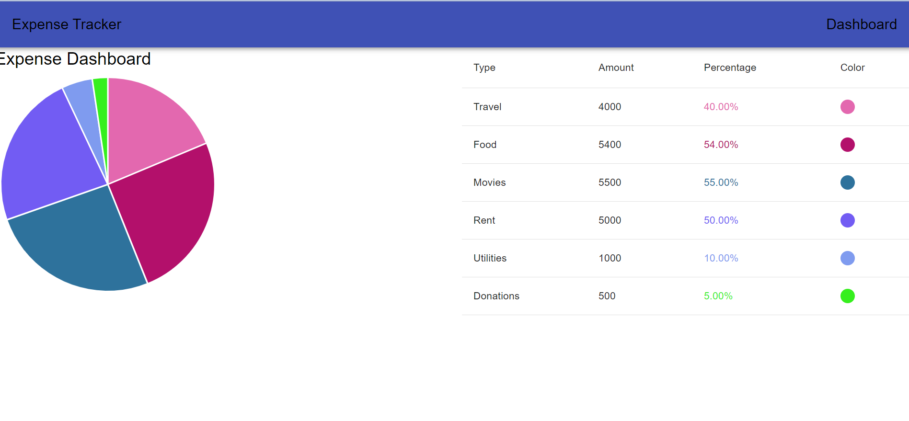
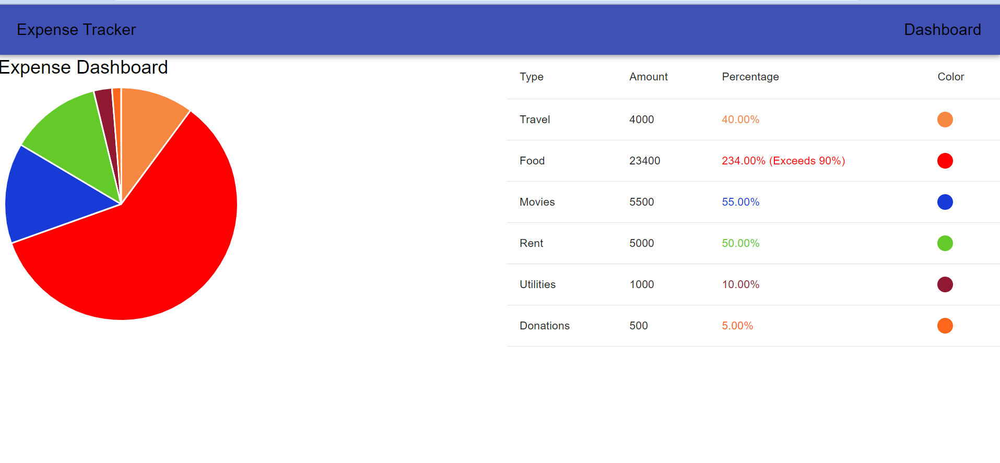
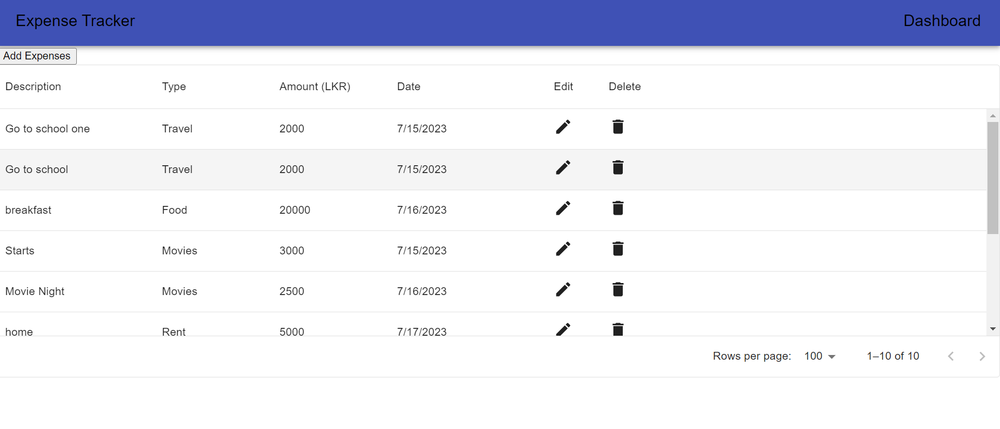
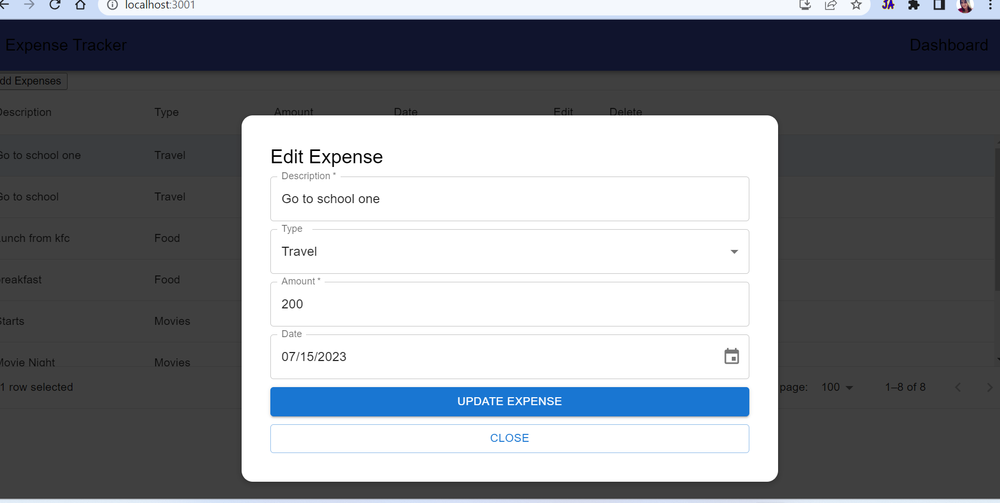
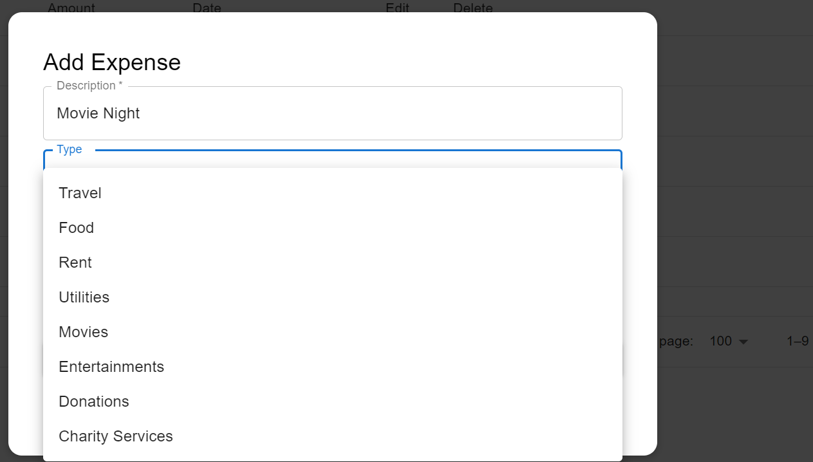
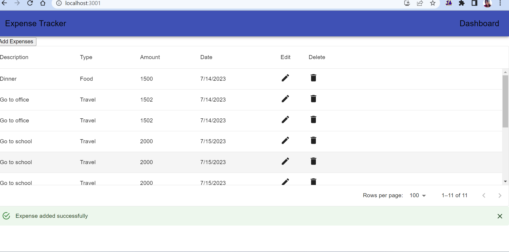
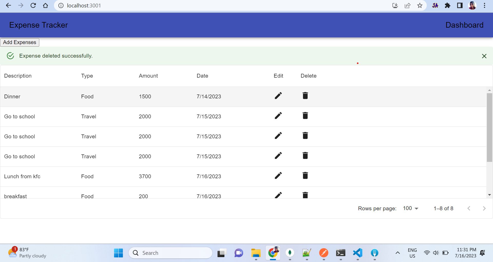
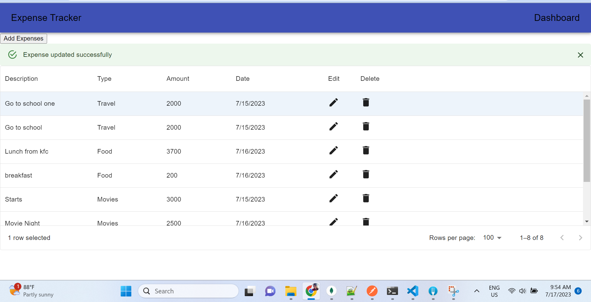

# Expense Tracker Frontend

This is the frontend application for the Expense Tracker. It allows users to track their expenses and view expense reports.

## Features

- Add new expenses
- View list of expenses
- Error handling for API requests
- Success alert message

## Technologies Used

- React
- axios
- Material-UI

## Getting Started

Follow these instructions to get the frontend application up and running on your local machine.

### Prerequisites

- Node.js (version X.X.X)
- npm (version X.X.X)

### Installation

1. Clone the repository:

   ```bash
   git clone git@github.com:ruchini/expense-tracker-frontend.git
   ```

2. Navigate to the project directory:

   ```bash
   cd expense-tracker-frontend
   ```

3. Install the dependencies:

   ```bash
   npm install
   ```

### Configuration

1. Open the `src/api.js` file.

2. Update the Base url endpoint based on your backend server configuration:

   ```javascript
   API_BASE_URL = 'http://localhost:3000'
   ```

### Usage

1. Start the development server:

   ```bash
   npm start
   ```

2. Open your web browser and navigate to `http://localhost:3001` to access the application.

### Working App

Uploaded the working app images inside src/assests folder.

ex: 

















